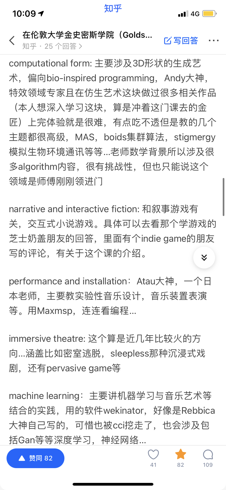
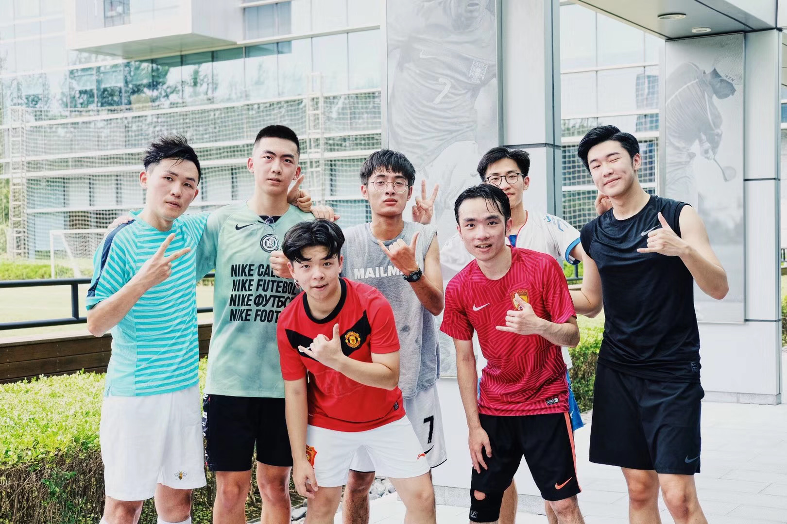

# 17-广告-龚绎明-伦敦大学学院

## 基本背景

> 均分：87分
>
> 五段实习经历（包括4a广告公司，电视台，策展等）
>
> 数个广告相关奖项和奖学金

## 申请结果

> 最终录取学校：UCL Bartlett建筑学院 design for performance and interaction（UCL qs世界排名第十，Bartlett建筑学院qs排名位列全球第二）
>
> 其他录取结果：
>
> * **获得Offer:**
>
>   Goldsmith  computational art；Loughborough  creative media design
>
>   此外还有社科类kcl, 曼大, leeds，悉尼等offer，以及RCA digital direction waiting list.
>
>   再此外还有ual的石沉大海...

## 申请心得

### 1. 时间线梳理

艺术类留学的准备时间相较于传媒社科类专业而言需要更长的准备时间以及更复杂的准备过程，需要自己调研与梳理的内容也更多，但是好在由于英国对语言的相对宽松，语言成绩可以在网申结束后再开始准备，使得我在申请季前可以一心一意专攻作品集。

我的时间线大致如下：

* 2019年暑期（即大二暑假）开始着手实习，为研究生申请提供实践背景支持

* 2019年末 英国夏校申请（后由于疫情取消）btw，英国大学暑期课程就今年申请而言作用有限，如果没有机会获得教授推荐信的话意义不大。

* 2020年3月 确定留学方向，开始着手制作作品集。因为最终下定决心转专业的时间较晚，所以最终只有不到一年的时间准备作品集，这也导致了没有赶上RCA第一轮的申请。如果你决定走艺术设计方向，最好能留出一年及以上的时间来创作项目，并且把控好进度。

* 2020年10月 开始传媒社科类网申

* 2021年1月 开始数字媒体类网申

* 2021年4月1日 通过面试获得巴院系主任给的口头offer，基本结束申请季
* 2021年5月15日 拿到巴院正式offer

（等了半年的巴院offer）

### 2. 申请季开始的准备

* 院校调研

  英国院校相较于美国而言清晰明了很多，毕竟学校也就这有限的几十所。但是市面上的中介机构对于申请院校**把控水平参差不齐**，并且会忽视一些**宝藏专业**和**提供一些错误信息**，所以这就需要我们自己针对自己的作品集方向与职业规划去**院校官网**进行调研。

  在这里我仅以**数字媒体方向**的申请来举例：

  数字媒体在英国是一门很概括的学科，包含了不同方向的各种专业，往往可能名字叫做digital media的专业并不是你想象中的课程。社科中有针对性数字媒体进行研究的项目，kcl和华威大学都有非常优秀的专业，但是和艺术类关系不大，在这里我不做过多讨论。

  在艺术设计中，数字媒体仍然有很多细分的分支。在偏向理论研究的方向上，UAL坎伯韦尔学院的fine art有digital art的pass way，侧重于研究当代艺术中关于数字艺术的批判性思想，除此之外ucl ioe学院下的digital media：critical studies同样注重理论的研究。而实践为主的项目中，不同院校的数字媒体课程也有自己的侧重点。RCA的digital direction原本是电影专业的一个分支，所以他们的课程更多的注重影像的表达，运用数字媒体技术来讲故事；伦艺lcc的graphic media design则关注于平面媒体与新媒体艺术的结合；而伦艺cci的学科和金匠的computational art则更加偏向于编程与可视化；金匠的VR＆AR从毕业作品上来看聚焦于在电子游戏中的运用。另外还有一些专业有着数字媒体方向的passway，比如我录取的巴院dfpi这个项目，他其实是一个比较偏向工业设计的专业，但是他有关于虚拟空间和影像的研究方向，**这也是我选择它的重要原因**。所以当我们在进行选校的时候，应该**多多关注每个专业背后的调性与偏好**，渠道可以来自于专业官网，老师和院系的ins，知乎上的前辈分享，这样不仅可以**提高申请的成功率做到对点打击**，也可以帮助你更加了解自己申请的专业找到**最感兴趣的发展方向**。英国的数字媒体专业远不止我提到的这些，如果有什么疑问或者想深入了解的话也欢迎来问我！

  

  

* 背景提升

  英美院校的申请相比于国内考研会更注重**个人的软背景**，包括但不限于实习，创业，奖项等，这些内容不仅仅是写在个人简历中，更重要的是体现在学校需要提交的个人陈述（ps）里来体现你和申请专业的**契合度**。

  在实习方面，我在高中毕业经历了我的第一份在安徽广播电视台的实习，在大二升大三的暑假正式开始了以留学为目标的实习。在我寻找实习的过程中，**公司的title和实习体验**是两个我最看重的两项标准，我认为在实习过程中跟随项目的经历或者工作中的**量化产出**是在申请中对于我们帮助最大的部分，**可以表现在文书中来阐述我们对于这门学科更加深入的体会**。

  

  

  在奖项方面，通过我们本科学校的平台我们也有参与各种专业比赛的机会，比如广告学科中的大广节，one show等等，这些**参与比赛的过程**也可以成为我们文书中的重要内容，传递给招生官一个更加饱满优秀的形象。

  除此之外，我们还可以在简历和文书中稍微提及一些我们**与众不同的特长**，比如说运动或者音乐。就我个人而言，我喜欢踢足球，跟着院里足球队水到过一些奖杯，并且我喜欢看英超的比赛，这样就增加了和英国的连接度，运气好的话还能拉近和招生官的距离。

  

### 3.  作品集制作

在艺术类留学中，作品集即portfolio可以说占据了**绝对重要的地位**，在很大一部分程度上直接决定了学校要不要你。在当前什么都卷的态势下，辅导机构也成为了大多数艺术留学生的必然选择，所以创作作品集的第一步其实就是找到一个**靠谱的作品集辅导机构**。市面上的每家机构都有自己的长处和特色，也几乎每一家机构都能在知乎上找到黑料，所以这也是一个很艰辛的调研过程，你需要去了解不同机构的老师，找到能聊得来风格很搭的并且负责任的老师，在这个过程中没有人可以帮助你，**只有你可以对自己的决定负责**。

在确定了辅导机构之后，就正式开始了作品集的制作。一般情况下我们需要创作4-5个项目，这里的项目和我们的学生作业是完全不同的难度和体量，我也在北京度过了每天学习十二小时，死啃油管上教程的五个多月。在这个过程中个人能力的提升是巨大的，导致我在做完作品集看我以前做的东西时，甚至不想承认作者是我...

我一共完成了四个项目，包含了VR，AR，声音可视化，游戏等方面，我可以通过我其中一个项目带大家了解一下一整个项目创作的流程。

Neighbots这个项目是我创作的第一个项目，最终的产出是一个AR系统。因为英国院校非常注重调研和创作过程，所以我们需要较大的篇幅来讲述我们的灵感来源，调研过程以及视觉实验等等，然后在最后给出我们的成品。

我这个项目的灵感来自于我本科的传媒课程，来源于麦克卢汉关于media is message的理论（本人论文憋不出一个字的学术菜鸡没想到还有能用上麦克卢汉先生的一天），他提出了媒介对我们的社会和生活会产生潜在的影响，而在互联网不断发展的背景下，我们更深的被这种影响笼罩但又不易察觉，所以我通过多种方法来进行了视觉实验和调研，最终聚焦到网络中广泛存在又容易被我们忽略的bots上，也就是非人为的虚拟流量。

之后呢，我将这些bots进行了分类和拟人化，并且依据他们各自的特点设计和制作了可穿戴的装置在现实生活场景中去cosplay他们（一个提醒：不要在室内用电钻钻轮胎，气味堪比自杀），并且拍摄了一些有意义的摄影作品，思考了他们与我们生活之间的关联。这也是我这个项目视觉调研的一部分，他需要有一个缜密的逻辑来串联起一个项目，而不同于我们自己拍东西或者做作品时的天马行空。

最后，由于我想把这种直观的感受带给更多的观众，我将这些形象转换成了3d模型，并且最终通过ar的形式让更多的人去看到，至此整个项目基本完成，总耗时大概两个多月。

### 4. 网申与面试

在完成了作品集的制作后，各大院校的申请通道应该都已经开启了，在网申的过程中有下列一些事项是必须要注意的！

* 注意院校网申ddl，**能早申尽量早申**。英国院校的申请基本上有两种逻辑，按round（轮次）和rolling（滚动录取）。譬如爱丁堡和RCA有明确的各轮次截止日期，我们需要在规定日期前上传全部文件才可以赶上审理，**并且绝大多数情况下第一轮的录取机会是最大的**。比如RCA今年就没有给第二轮一个名额！包括我在内的一大票申请者只能一直躺在waiting list里面等着被拍死或者捞起来，这样就丧失了申请的主动权。此外，**一些学校的ddl会反复横跳**，以伦艺各学院最为典型，它会根据申请数量的多少不停调整截止日期，导致你最终也不知道他会在某一天突然关闭通道，而解决问题的最好办法就是尽早完成作品集。其他一些rolling的学校相对友好，但是同理也是越早递交申请录取可能性越高，因为你也不知道它什么时候会满员。

* 关注申请要求**细节**。由于英国申请人数越来越多，英国院校的**肘手要求**也不断变多，譬如RCA从去年开始增加的两分钟个人视频录制，伦艺今年也紧随其后，在多个专业里增添了个人视频的要求，加上原本就要写的study proposal，事儿是相当多。除此之外，每个学校作品集，ps等的上传格式要求也不尽相同，需要我们提前做好应对，不然邻近ddl的时候便会焦头烂额。还有一些学校对于申请者有一些**特殊要求**，比如金匠的digital media专业需要有工作经历；爱丁堡的design＆digital media不允许跨专业申请等等都需要我们提前了解，因为这些要求不一定会在醒目的位置，所以可能由于中介老师的不小心疏忽遗漏掉。

  

* 注意随时查看邮箱。因为申请进度的更新以及学校要你补充的材料都会在邮件上通知你，所以你自己或是中介老师**注意把控邮箱的更新**很重要。除此之外，**面试通知**也会通过邮箱的方式告诉你，有时候面试官预留给你的**准备时间很短**，恰逢周末中介老师不上班，可能他周一告诉你时你的准备时间已经不多了。
* 可以在**微博或微信群**关注专业动态。有些学校的审理进度非常慢，往往几个月都没个气，所以微博是我们可以获取资讯的好平台，在各个学校的超话已经一些专攻英国留学的博主**（如崔钟博汶cook，英国大学申请中心等）**都可以较快地得知一些新的动态；同样的加入一些专业的申请群，面试群，offer群也都可以和一起申请的同学们互通有无。

在网申结束后，一些学校就开始为通过初审的申请者组织面试，当收到面试通知的时候其实意味着离offer已经不远了！当我们收到面试通知后，我们要做的第一件事就是**去微博，知乎，或者自己的老师那里问面经！**提前准备好可能会被问到的问题绝对比现场来一段英语freestyle强多了。除此之外，面试不是口语考试，面试官大多都是专业的老师或系主任，相当友善且幽默，整个过程也更像是聊天，所以**调整好心态，不用过于紧张**。

> 以上就是我关于申请季（或许是申请年）的经验总结啦，如果有什么疑问的话都欢迎来问我，大家都有光明的未来！